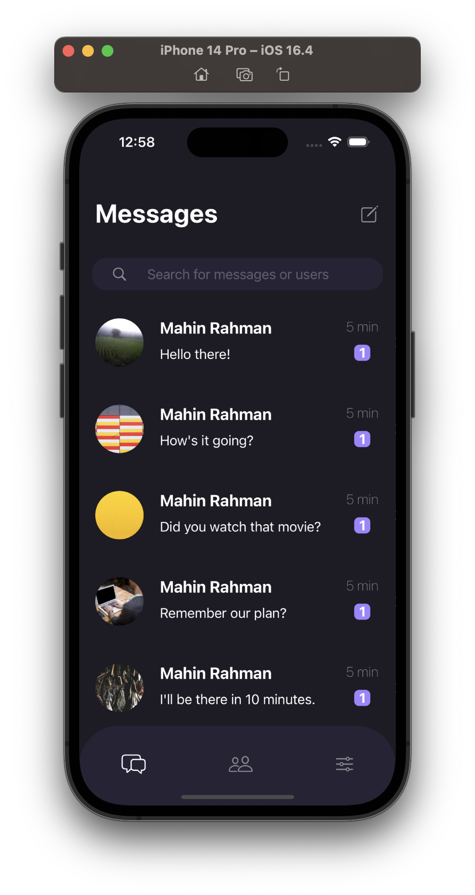
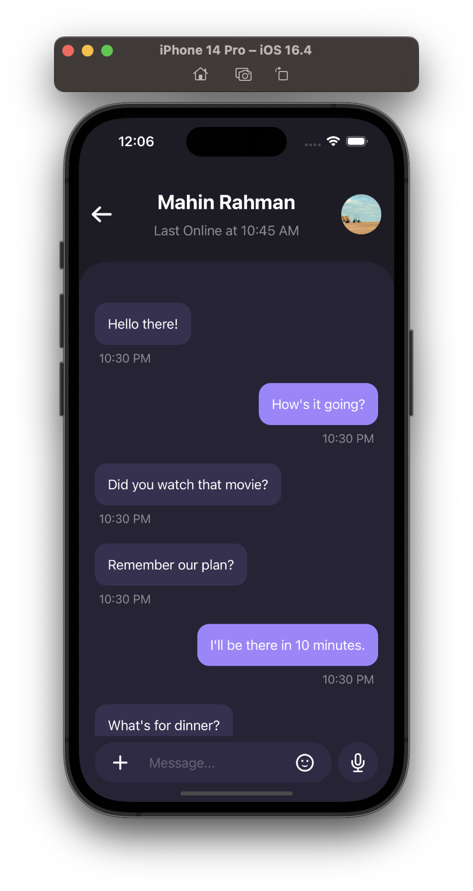
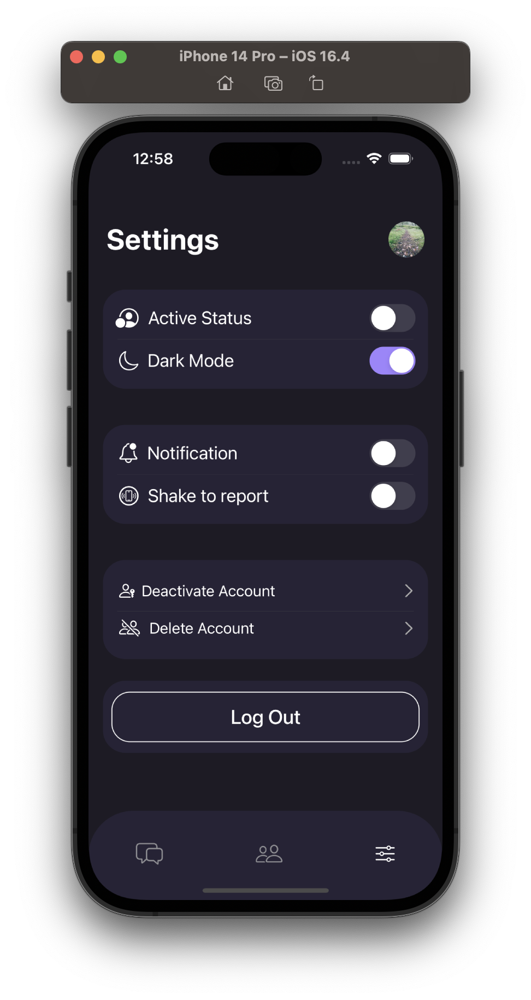
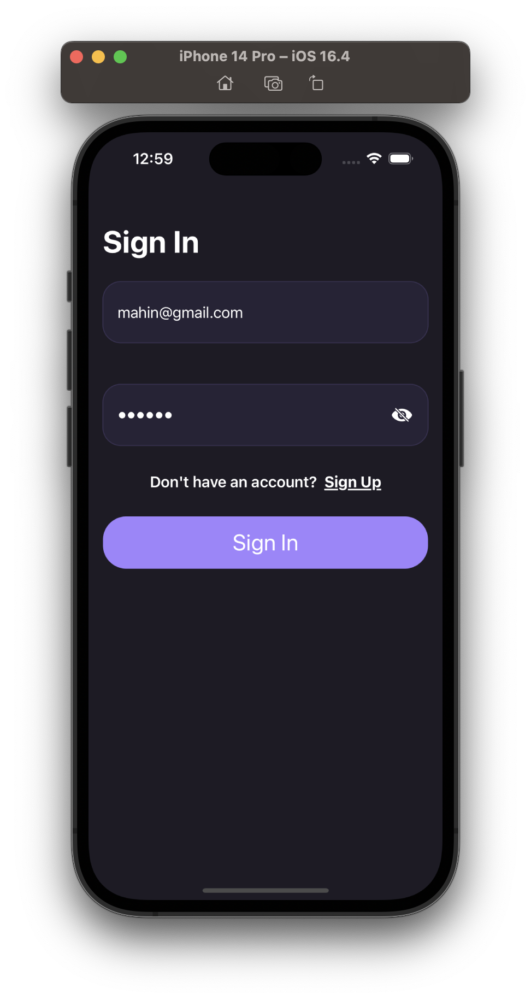
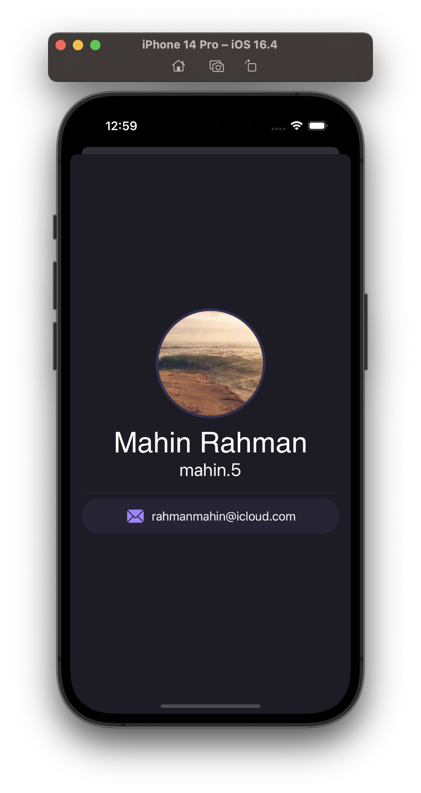

<!-- Copyright 2023 Md. Mahinur Rahman-->
<!---->
<!-- Licensed under the Apache License, Version 2.0 (the "License");-->
<!-- you may not use this file except in compliance with the License.-->
<!-- You may obtain a copy of the License at-->
<!---->
<!--     http://www.apache.org/licenses/LICENSE-2.0-->
<!---->
<!-- Unless required by applicable law or agreed to in writing, software-->
<!-- distributed under the License is distributed on an "AS IS" BASIS,-->
<!-- WITHOUT WARRANTIES OR CONDITIONS OF ANY KIND, either express or implied.-->
<!-- See the License for the specific language governing permissions and-->
<!-- limitations under the License.-->

<h1>Poke</h1>
  Poke is an iOS app built with SwiftUI that is a general purpose chatting application

<h3>Graphical User Interface</h3>
  <table style="border:none">
    <tr>
      <td></td>
      <td></td>
      <td></td>
     </tr>
     <tr>
       <td></td>
      <td></td>
     </tr>
  </table>
  
  <h3>Requirements</h3>
    <ol>
        <li>iOS 16.4 or later</li>
        <li>Xcode 12.0 or later</li>
        <li>Swift 5.3 or later</li>
    </ol>

<h3>Getting Started</h3>
  To clone this app and run it on Xcode, follow these steps:

<ol>
    <li>Clone the repository: git clone https://github.com/MahinMuhammad/Poke</li>
    <li>Open the Poke.xcodeproj file in Xcode.</li>
    <li>Change the Bundle Identifier as your own.</li>
    <li>Make a firebase project and add the google plist inside your project</li>
    <li>Build and run the project in Xcode.</li>
</ol> 
  
<h3>Features</h3>
  The project is currently in an UI UX phase so most of the datas are dummy.
<ul>
  <li>Signin or Signup using firebase auth</li>
  <li>Show chatlist dummy</li>
  <li>Several options in Settings view</li>
  <li>Shows dummy profile</li>
</ul>   
  
<h3>Future Updates</h3>
  In the next update, I plan to have the following:
<ul>
  <li>Let user preview/update his/her own profile</li>
  <li>Let user chat with other users</li>
  <li>Let user make friends and see them in friendlist</li>
</ul> 
    
<h3>Contributing</h3>
  I welcome contributions from the community! To contribute to Poke, follow these steps:

<ol>
    <li>Fork the repository.</li>
    <li>Create a new branch for your feature: git checkout -b feature/your-feature-name.</li>
    <li>Make your changes and commit them: git commit -m "Add your commit message here".</li>
    <li>Push your changes to your forked repository: git push origin feature/your-feature-name.</li>
    <li>Submit a pull request to the main repository.</li>
</ol>
  
<h3>License</h3>
  This project is licensed under the Apache License 2.0 - see the LICENSE file for details.

<h3>Contact</h3>
  If you have any questions or comments about ChatGenie, feel free to reach out to me at rahmanmahin@icloud.com.

<table style="border:none">
  <tr>  
    <td align="center"></h4></td>
  </tr>
  <tr>  
    <td align="center"><h4>Developed by   Md. Mahinur Rahman</h4></td>
  </tr>
</table>
